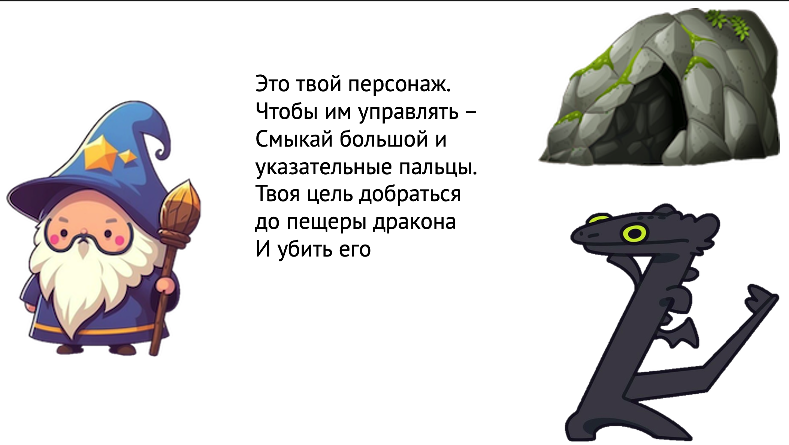
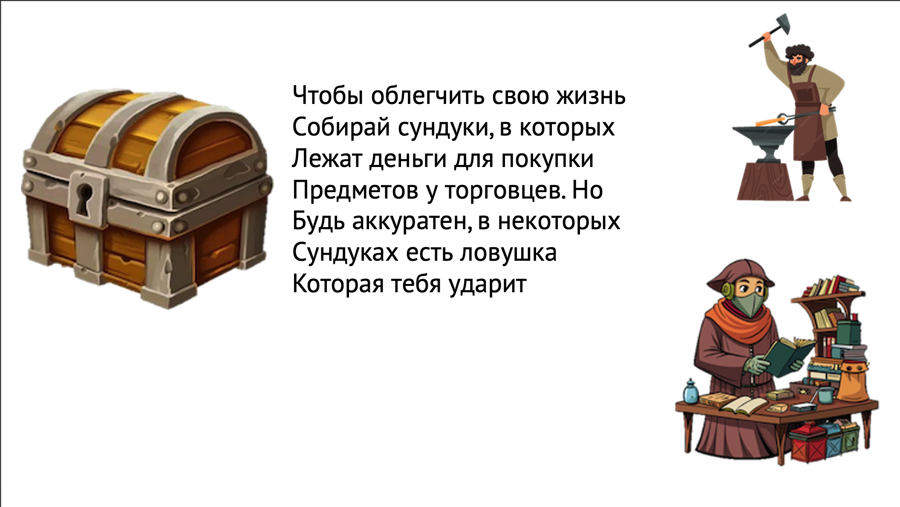

1. Название проекта: "Role Game"
2. Описание: В этой игре вы сможете управлять персонажем, собирать сундкуи, покупать пердметы и победить финального боса.
    Требования: экран минимум 1280x720, хорошее освещение, если у вас Windows, то в дерикториях файлов надо заменить слешы на обратные
3. Установка: для запуска игры требуется приложение, поддерживающее язык программирования Python, далее в этом приложении введите в консоль эту команду без кавычек: "pip install -r requirements.txt". Экран минимум 1280x720, хорошее освещение, если у вас Windows, то в дерикториях файлов надо заменить слешы на обратные
4. Использование: для развлечения
5.  
6. Много еще много добавить, но для альфа версии сойдет